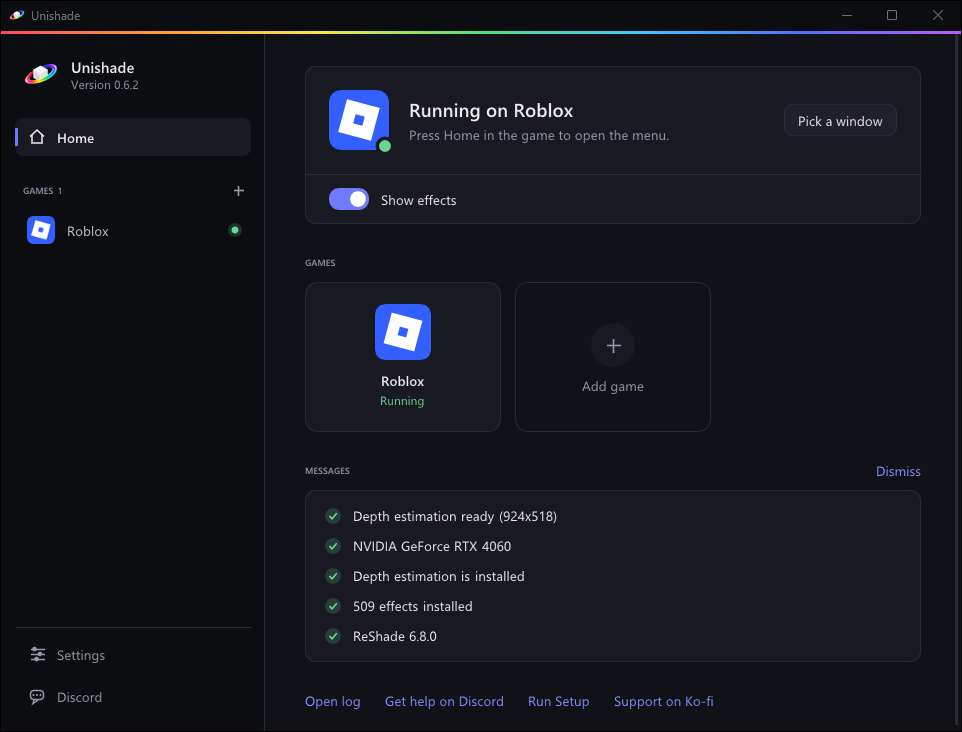

You need 64-bit Windows 10 version 2004 or newer, or Windows 11. For a Mac or Linux, see [macOS and Linux](/docs/macos-linux/).

## Run Setup

[Download Setup](/download/) and run it. Keep the suggested folder, `%LOCALAPPDATA%\Programs\Unishade`, or pick your own, as long as it isn't inside a game's folder.

Setup isn't code-signed yet, so the first time Windows may say **Windows protected your PC**. Click **More info**, then **Run anyway**.

## Pick add-ons

ReShade and every official ReShade effect are always included. Keep **Presets** on for ready-made looks.

Two add-ons are optional:

- **Depth estimation** makes ambient occlusion, depth of field and fog work. It costs some frame rate.
- **DLSS5** needs an NVIDIA RTX card. See [DLSS5](/docs/add-ons/#dlss5) after installing.

Accept ReShade's license, and Setup downloads and installs everything.

## Start Unishade

Leave **Start Unishade now** checked and click **Finish**. Next time, start **Unishade** from the Start menu.

Closing the Unishade window leaves Unishade running in the notification area. To quit, right-click its icon there and choose **Quit**.

Next, [add your game](/docs/games/#add-a-game).

## Updating

Only the newest version is supported. On Windows, the Unishade window and the menu's **Status** tab link to a new version when one is out. If you'd rather check yourself, turn off **Check for updates** in the menu's **Settings**. Run the new Setup and your presets, settings, shortcuts and games stay.

On macOS and Linux, Unishade doesn't check for updates. Get new versions from the [download page](/download/#macos-and-linux).

### Coming from RobloxShadeHost

Unishade is RobloxShadeHost's new name. Run Unishade Setup and it upgrades your install in place, presets and settings included.

If you installed without Setup, replace `RobloxShadeHost.exe` with `Unishade.exe` in the same folder and update your shortcut.

## Uninstalling

Open **Unishade Setup** from the Start menu and choose **Uninstall**. Your presets, settings and games stay unless you tick the box to delete them.

## Installing without Setup

1. Put `Unishade.exe` from the [download page](/download/) in its own folder.
2. Run a current ReShade installer from [reshade.me](https://reshade.me/#download), the version with full add-on support. Pick `Unishade.exe`, not the game, and **DirectX 10/11/12**.
3. Start `Unishade.exe`.

The add-ons need Setup.
